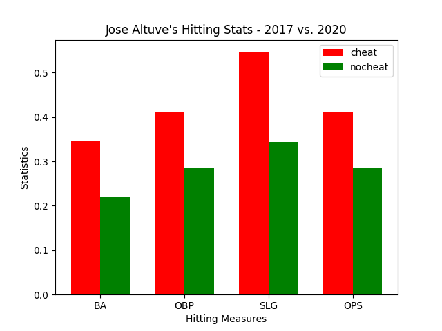
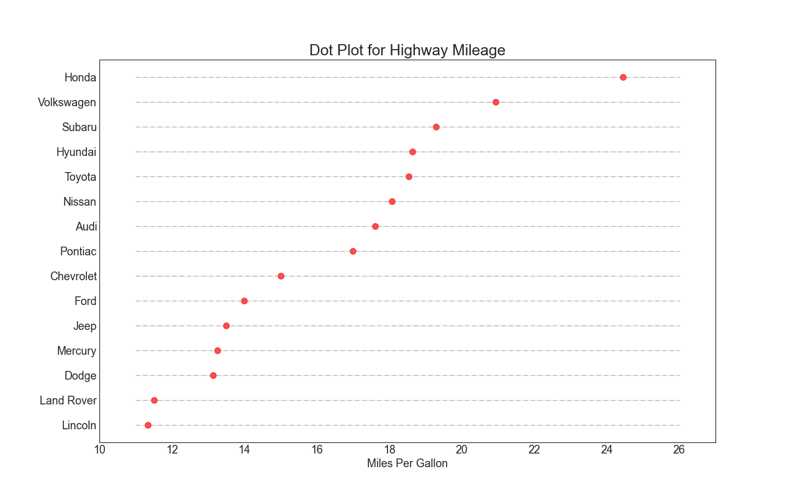

# Matplotlib HW
## Jose Altuve's 2017 Stats vs 2020 Stats

**My Graph**:The Astros were accused and found of cheating in 2017, the year they won the World Series. Jose Altuve was a main factor in their season. This shows the difference in his hitting statstics between his "cheating" 2017 season and 2020 season.

I found my MLB data [HERE!](https://appac.github.io/mlb-data-api-docs/).

## Car Producers' Miles Per Gallon

**My Graph**: This dot plot shows the miles per gallon each car producer averages. At the top is Honda, the most efficient car producer as far as MPG on highway goes. The least efficient is Lincoln. I have a Jeep, which isn't a very efficient car as shown on this plot.

I found my MPG data [HERE!](https://raw.githubusercontent.com/selva86/datasets/master/mpg_ggplot2.csv).
